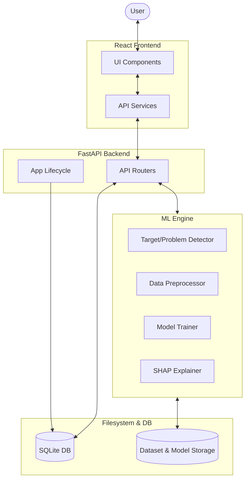

# 🏗️ Architecture Guide — Unified ML Platform

## Overview
The Unified ML Platform is an AutoML-style application designed to simplify the end-to-end machine learning workflow. It enables users to upload datasets, automatically detect problem types (Binary Classification, Multi-Class Classification, or Regression), perform Exploratory Data Analysis (EDA), train multiple models with hyperparameter tuning, and generate explainable predictions using SHAP.

## System Architecture

The platform follows a classic client-server architecture:

- **Frontend:** Built with **React 19** and **Vite**, providing a modern, responsive user interface. It communicates with the backend via a RESTful API.
- **Backend:** A **FastAPI** application that serves as the orchestration layer for the ML Engine and handles request routing, data persistence, and asynchronous task management.
- **ML Engine:** A specialized layer using **Scikit-Learn**, **XGBoost**, and **SHAP** for data processing, model training, and explainability.
- **Storage:** Uses **SQLite** for metadata and job tracking, and the local filesystem for dataset uploads, serialized models (`joblib`), and generated reports.

## Component Breakdown

### 1. Frontend (React)
- **Pages:** Modular UI components for each stage of the ML lifecycle (Dataset, Analyzer, Training, Evaluation, Explainability, Prediction).
- **Services:** Axios-based API client for structured communication with the backend.
- **State Management:** Page-level state with backend-driven persistence.

### 2. Backend (FastAPI)
- **Routers:** Endpoint groups for `dataset`, `training`, `prediction`, and `models`.
- **Lifespan Management:** Handles database initialization and resource cleanup.
- **Middleware:** CORS support for development and production environments.

### 3. ML Engine
- **Analyzer/Detector:** Logic for target recommendation and problem type detection.
- **Preprocessor:** Robust pipeline for imputation, encoding, scaling, and feature selection.
- **Trainer:** Automated model selection and hyperparameter optimization.
- **Explainability:** SHAP-based feature importance and prediction explanations.

## Data Flow
1. **Ingestion:** User uploads CSV -> Backend validates and saves to `data/uploads/`.
2. **Analysis:** Backend analyzes columns -> User selects target -> Problem type is detected.
3. **Training:** Async pipeline starts -> Preprocessing -> Model Training -> Evaluation -> Serialization.
4. **Insight:** SHAP plots and EDA visualizations are generated and served as Base64-encoded strings.
5. **Prediction:** User provides input -> Backend loads model -> Preprocessing -> Inference -> Explainability.

## Technology Stack
- **Backend:** FastAPI, Uvicorn, Pydantic, SQLite.
- **Frontend:** React, Vite, Axios, Lucide Icons, Tailwind CSS (or similar).
- **ML/DS:** Scikit-Learn, Pandas, NumPy, XGBoost, SHAP, Matplotlib, Seaborn.
- **Deployment:** Makefile-based automation, standard Python/Node environments.
